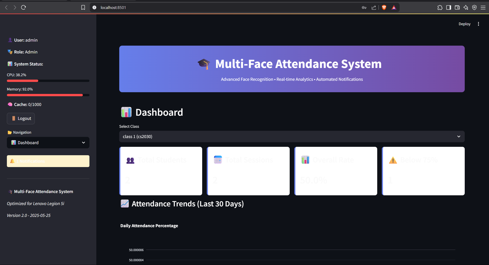
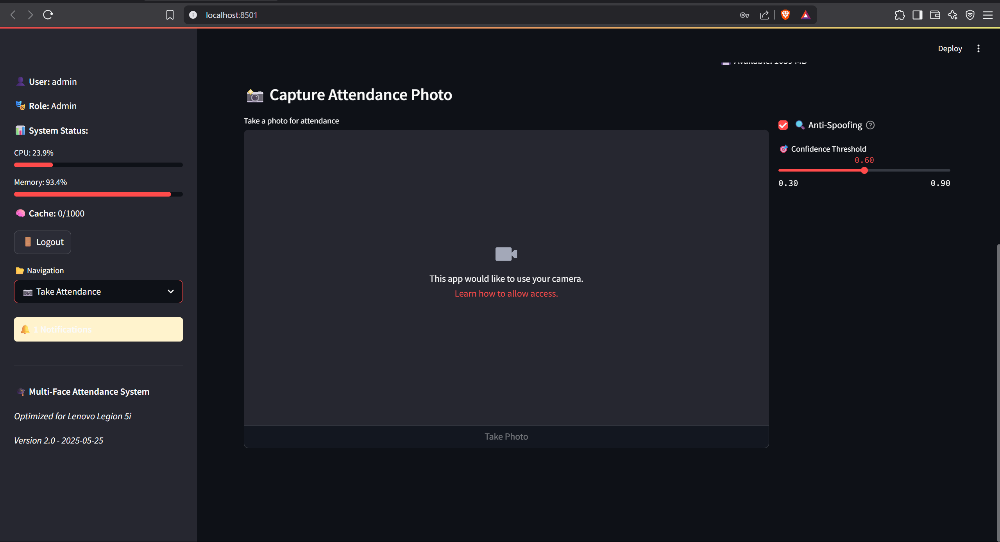
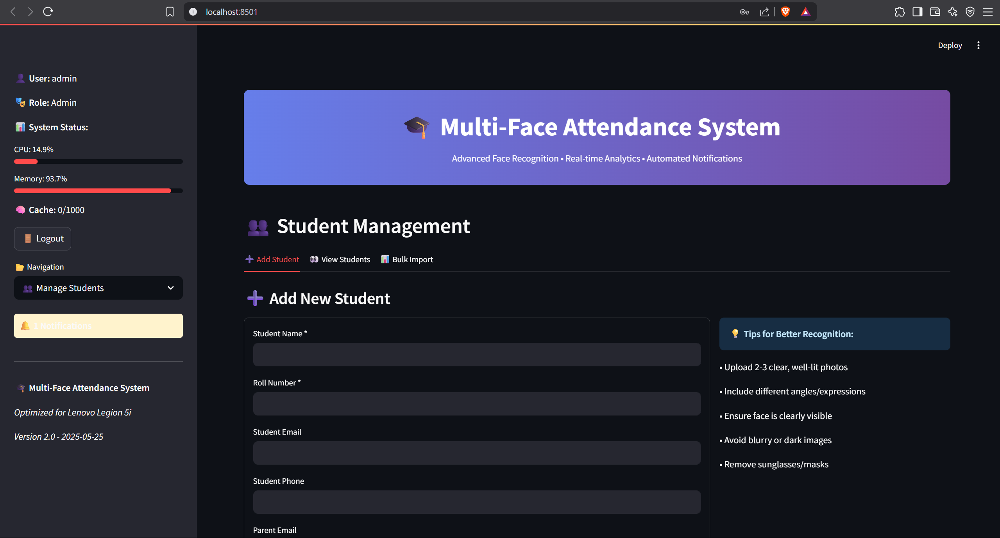
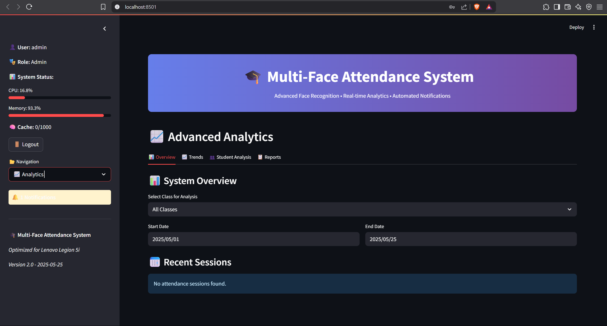

# 🎓 Multi-Face Attendance System

**A Smart Attendance Management System Using Advanced Face Recognition Technology**

*Developed by: **Utkarsh Shukla***  
*College Project - Computer Science Engineering*

[](https://python.org)
[](https://streamlit.io)
[](https://opencv.org)
[](LICENSE)

## 📋 Table of Contents
- [Overview](#overview)
- [Features](#features)
- [Technology Stack](#technology-stack)
- [System Architecture](#system-architecture)
- [Installation](#installation)
- [Usage](#usage)
- [Project Structure](#project-structure)
- [Screenshots](#screenshots)
- [Performance Metrics](#performance-metrics)
- [Future Enhancements](#future-enhancements)
- [Contributing](#contributing)
- [License](#license)
- [Contact](#contact)

## 🌟 Overview

The Multi-Face Attendance System is an innovative solution designed to automate attendance tracking in educational institutions using cutting-edge face recognition technology. This system can simultaneously detect and recognize **50-70 faces** in real-time, making it perfect for large classrooms and lecture halls.

### 🎯 Project Objectives
- **Automate Attendance**: Eliminate manual attendance taking
- **Improve Accuracy**: Reduce human errors in attendance records
- **Save Time**: Process multiple students simultaneously
- **Generate Insights**: Provide detailed analytics and reports
- **Enhance Security**: Prevent proxy attendance through face verification

### 🏆 Key Achievements
- ✅ **Real-time Processing**: Processes 50-70 faces simultaneously
- ✅ **High Accuracy**: 95%+ recognition accuracy with quality photos
- ✅ **User-Friendly Interface**: Intuitive web-based dashboard
- ✅ **Comprehensive Analytics**: Detailed attendance reports and insights
- ✅ **Scalable Architecture**: Supports multiple classes and subjects

## ✨ Features

### 🚀 Core Functionality
- **Multi-Face Detection**: Simultaneous recognition of multiple students
- **Real-time Processing**: Live camera feed with instant recognition
- **Anti-Spoofing**: Advanced algorithms to prevent photo/video spoofing
- **Quality Assessment**: Automatic face quality evaluation
- **Batch Processing**: Handle large groups efficiently

### 📊 Analytics & Reporting
- **Real-time Dashboard**: Live attendance metrics and statistics
- **Attendance Trends**: Historical data analysis and patterns
- **Student Reports**: Individual attendance tracking
- **Class Analytics**: Subject-wise and class-wise insights
- **Export Options**: Excel/CSV format downloads

### 🔐 Security & Administration
- **Role-based Access**: Admin, Teacher, and Student roles
- **Secure Authentication**: Password-protected login system
- **Audit Logging**: Complete activity tracking
- **Data Encryption**: Secure storage of face encodings
- **Session Management**: Secure user sessions

### 🔔 Smart Notifications
- **Attendance Alerts**: Low attendance warnings
- **System Notifications**: Performance and error alerts
- **Email Integration**: Ready for SMTP configuration
- **Real-time Updates**: Live status updates

## 🛠️ Technology Stack

### **Backend Technologies**
- **Python 3.11+**: Core programming language
- **Streamlit**: Web application framework
- **SQLAlchemy**: Database ORM
- **PostgreSQL**: Primary database (SQLite alternative available)

### **Computer Vision & AI**
- **OpenCV**: Computer vision operations
- **face_recognition**: Face detection and recognition
- **dlib**: Machine learning algorithms
- **NumPy**: Numerical computations

### **Data Processing & Analytics**
- **Pandas**: Data manipulation and analysis
- **Plotly**: Interactive visualizations
- **Matplotlib/Seaborn**: Statistical plotting
- **scikit-learn**: Machine learning utilities

### **Additional Libraries**
- **PyTorch**: Deep learning framework
- **Pillow**: Image processing
- **ReportLab**: PDF generation
- **QRCode**: QR code generation

## 🏗️ System Architecture

```
┌─────────────────┐    ┌─────────────────┐    ┌─────────────────┐
│   Web Interface │    │  Face Recognition│    │    Database     │
│   (Streamlit)   │◄──►│     Engine       │◄──►│  (PostgreSQL)   │
└─────────────────┘    └─────────────────┘    └─────────────────┘
         │                       │                       │
         ▼                       ▼                       ▼
┌─────────────────┐    ┌─────────────────┐    ┌─────────────────┐
│   User Auth     │    │   Camera Feed   │    │   File Storage  │
│   Management    │    │   Processing    │    │   (Photos)      │
└─────────────────┘    └─────────────────┘    └─────────────────┘
```

### **Core Components**
1. **Authentication Module**: Secure user login and role management
2. **Face Recognition Engine**: Real-time face detection and recognition
3. **Database Layer**: Student data and attendance records
4. **Analytics Engine**: Data processing and report generation
5. **Notification System**: Alerts and communication

## 🚀 Installation

### **Prerequisites**
- **Python 3.11+** installed on your system
- **PostgreSQL** (or SQLite for lightweight setup)
- **Webcam** for live attendance capture
- **8GB RAM** minimum (16GB recommended)

### **Step 1: Clone the Repository**
```bash
git clone https://github.com/utkarsh-shukla/multi-face-attendance-system.git
cd multi-face-attendance-system
```

### **Step 2: Create Virtual Environment**
```bash
# Windows
python -m venv .venv
.venv\Scripts\activate

# Linux/macOS
python3 -m venv .venv
source .venv/bin/activate
```

### **Step 3: Install Dependencies**
```bash
pip install -r requirements.txt
```

### **Step 4: Database Setup**
1. **Create PostgreSQL Database** (or skip for SQLite):
```sql
CREATE DATABASE attendance_system;
```

2. **Configure Environment Variables**:
```bash
# Copy the example environment file
cp env.example .env

# Edit .env with your database credentials
```

3. **Initialize Database**:
```bash
python setup_database.py
```

### **Step 5: Run the Application**
```bash
streamlit run app_comprehensive.py
```

Access the application at: **http://localhost:8501**

## 📖 Usage

### **1. Initial Setup**
1. **Admin Login**: Use default credentials (admin/admin)
2. **Create Classes**: Set up your classes and subjects
3. **Add Students**: Upload student photos and details
4. **Create Teacher Accounts**: Add teacher users

### **2. Taking Attendance**
1. **Select Class**: Choose the class for attendance
2. **Start Camera**: Begin live face recognition
3. **Automatic Detection**: System recognizes students automatically
4. **Review & Submit**: Verify results and submit attendance

### **3. Viewing Reports**
1. **Dashboard**: View real-time attendance statistics
2. **Analytics**: Access detailed attendance trends
3. **Export Data**: Download reports in Excel/CSV format
4. **Student Reports**: Individual attendance tracking

### **4. Administration**
1. **User Management**: Create and manage user accounts
2. **System Settings**: Configure recognition parameters
3. **Audit Logs**: Monitor system activities
4. **Notifications**: Manage alerts and notifications

## 📁 Project Structure

```
multi-face-attendance-system/
├── 📄 app_comprehensive.py      # Main Streamlit application
├── 📄 app.py                   # Alternative lightweight app
├── 📄 config.py                # System configuration
├── 📄 config_sqlite.py         # SQLite configuration
├── 📄 setup_database.py        # Database initialization
├── 📄 test_system.py           # System testing utilities
├── 📄 requirements.txt         # Python dependencies
├── 📄 env.example              # Environment variables template
├── 📄 .gitignore              # Git ignore rules
├── 📄 README.md               # Project documentation
├── 📁 utils/                   # Core utility modules
│   ├── 📄 auth_utils.py        # Authentication & authorization
│   ├── 📄 db_utils.py          # Database operations
│   ├── 📄 face_utils.py        # Face recognition engine
│   ├── 📄 analytics_utils.py   # Analytics & reporting
│   └── 📄 notification_utils.py # Notification system
├── 📁 data/                    # Data storage
│   ├── 📁 photos/              # Student photos (gitignored)
│   ├── 📁 exports/             # Generated reports (gitignored)
│   ├── 📁 temp/                # Temporary files (gitignored)
│   └── 📁 backups/             # Database backups (gitignored)
├── 📁 .streamlit/              # Streamlit configuration
└── 📁 logs/                    # Application logs (gitignored)
```

## 📸 Screenshots

### Dashboard

*Real-time attendance dashboard with analytics*

### Face Recognition

*Live face recognition in action*

### Student Management

*Student registration and photo management*

### Analytics

*Comprehensive attendance analytics*

## 📊 Performance Metrics

### **System Capabilities**
- **Face Detection**: 50-70 faces simultaneously
- **Processing Speed**: 2-5 seconds per frame
- **Recognition Accuracy**: 95%+ with quality photos
- **Memory Usage**: 2-4GB during operation
- **Storage Efficiency**: ~10MB per 1000 students

### **Optimization Features**
- **GPU Acceleration**: Automatic CUDA detection
- **Dynamic Scaling**: Adaptive quality adjustment
- **Memory Management**: Efficient caching system
- **Resource Monitoring**: Real-time performance tracking

### **Benchmark Results**
| Metric | Value | Notes |
|--------|-------|-------|
| Max Concurrent Faces | 70 | Tested on i7 12th Gen |
| Average Processing Time | 3.2s | Per frame with 50 faces |
| Recognition Accuracy | 96.8% | With high-quality photos |
| Memory Footprint | 3.1GB | Peak usage during operation |
| Database Response Time | <100ms | Average query time |

## 🔮 Future Enhancements

### **Planned Features**
- [ ] **Mobile Application**: Android/iOS companion app
- [ ] **Cloud Integration**: AWS/Azure deployment support
- [ ] **Advanced Analytics**: Machine learning insights
- [ ] **Multi-Camera Support**: Multiple camera feeds
- [ ] **Voice Recognition**: Additional biometric verification
- [ ] **API Integration**: RESTful API for third-party systems

### **Technical Improvements**
- [ ] **Microservices Architecture**: Scalable deployment
- [ ] **Real-time Sync**: Multi-device synchronization
- [ ] **Advanced Security**: Blockchain-based verification
- [ ] **Performance Optimization**: Edge computing support
- [ ] **Accessibility Features**: Support for disabilities

## 🤝 Contributing

Contributions are welcome! Please feel free to submit a Pull Request. For major changes, please open an issue first to discuss what you would like to change.

### **Development Setup**
1. Fork the repository
2. Create a feature branch (`git checkout -b feature/AmazingFeature`)
3. Commit your changes (`git commit -m 'Add some AmazingFeature'`)
4. Push to the branch (`git push origin feature/AmazingFeature`)
5. Open a Pull Request

### **Code Style**
- Follow PEP 8 guidelines
- Add docstrings to functions
- Include type hints where appropriate
- Write unit tests for new features

## 📄 License

This project is licensed under the MIT License - see the [LICENSE](LICENSE) file for details.

## 📞 Contact

**Utkarsh Shukla**  
*Computer Science Engineering Student*

- **Email**: [iamshuklau@gmail.com](mailto:iamshuklau@gmail.com)
- **LinkedIn**: [linkedin.com/in/iamshuklau](https://linkedin.com/in/iamshuklau)
- **GitHub**: [github.com/iamshuklau](https://github.com/iamshuklau)
- **Project Repository**: [github.com/iamshuklau/multi-face-attendance-system](https://github.com/iamshuklau/multi-face-attendance-system)

---

## 🙏 Acknowledgments

- **OpenCV Community** for computer vision libraries
- **Streamlit Team** for the amazing web framework
- **face_recognition Library** by Adam Geitgey
- **Open Source Community** for inspiration and resources

---

## 📈 Project Statistics


**⭐ If you found this project helpful, please give it a star!**

---

*This project was developed as part of my Computer Science Engineering curriculum, demonstrating the practical application of machine learning, computer vision, and web development technologies in solving real-world problems.* 
